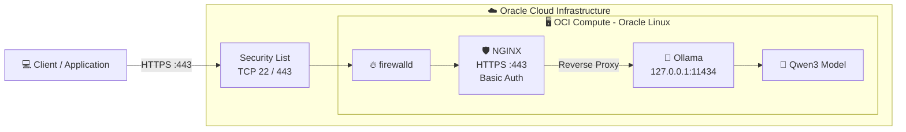

# Ollama on OCI

## Overview

This repository provides a reproducible way to deploy Ollama on Oracle Cloud Infrastructure (OCI) and expose its API through NGINX using HTTPS and Basic Authentication.

The solution uses:

- Terraform to provision the OCI infrastructure
- Ansible to configure the Compute instance
- Ollama to run a pre-trained LLM locally
- NGINX as the HTTPS reverse proxy and authentication layer

The goal is to keep the native Ollama API bound to `127.0.0.1:11434` while exposing only HTTPS port `443`.

## Architecture



## Prerequisites

The following tools are required on the local workstation:

* OCI account with permission to create Compute and networking resources
* OCI API signing key configured
* OCI CLI
* Terraform
* Ansible
* SSH key pair

The reference environment used during validation was:

* OCI Compute: ```VM.Standard.A1.Flex```
* OCPU: ```2```
* Memory: ```12 GB```
* Boot Volume: ```50 GB```
* Operating System: ```Oracle Linux 9```
* Ollama model: ```qwen3:4b```

This is a reference configuration, not a minimum requirement.

## Repository Structure
```text
.
├── ansible
│   ├── group_vars
│   │   └── all.yml
│   ├── inventory.example
│   ├── playbook.yml
│   └── templates
│       └── ollama.conf.j2
├── terraform
│   ├── data.tf
│   ├── main.tf
│   ├── network.tf
│   ├── outputs.tf
│   ├── terraform.tfvars.example
│   └── variables.tf
├── .gitignore
├── LICENSE
└── README.md
```
## 1. Configure OCI Authentication
Configure the OCI CLI using an API signing key. Create a ```/path/.oci/config.ini``` file with following content:
````
[DEFAULT]
user=ocid1.user.oc1..example
fingerprint=aa:bb:cc:dd:...
tenancy=ocid1.tenancy.oc1..example
region=sa-saopaulo-1
key_file=/path/to/oci_api_key.pem
````
Validate the configuration: ````oci iam availability-domain list````

## 2. Provision Infrastructure with Terraform
Go to the Terraform directory, and copy the example variables file:
````
cd terraform
cp terraform.tfvars.example terraform.tfvars
````

Update the required values, including:
````
tenancy_ocid
compartment_ocid
ssh_public_key_path
ssh_ingress_cidr
https_ingress_cidr
````
Use CIDR notation for access rules, for example: ````<YOUR-PUBLIC-IP>/32````

Initialize and validate Terraform:
`````
terraform init
terraform fmt
terraform validate
`````

Review the plan: ```terraform plan```

Provision the environment: ```terraform apply```

After completion, Terraform returns the instance details: ``` terraform output ```

## 3. Configure the VM with Ansible
Copy the inventory example:
````
cp ansible/inventory.example ansible/inventory
`````
Update the inventory with the public IP returned by Terraform and the local SSH private key. Example:
`````
[ollama]
ollama-server ansible_host=<PUBLIC_IP> ansible_user=opc ansible_ssh_private_key_file=/path/to/private/key
`````

Validate connectivity:
`````
ansible all \
  -i ansible/inventory \
  -m ping
`````

Run the playbook:
`````
ansible-playbook \
  -i ansible/inventory \
  ansible/playbook.yml \
  --extra-vars "nginx_auth_password=<PASSWORD>"
`````

The playbook installs and configures:
* Ollama
* qwen3:4b
* NGINX
* Basic Authentication
* self-signed TLS certificate
* SELinux network permission
* firewalld HTTPS rule

## 4. Validate the Endpoint

The external API is available through NGINX: ```https://<PUBLIC_IP>/api/tags```

### Test without authentication:
`````
curl -k -i https://<PUBLIC_IP>/api/tags
``````

Expected result: *HTTP/1.1 401 Unauthorized*

### Test with Basic Authentication:
`````
curl -k -u oio-api https://<PUBLIC_IP>/api/tags
`````

*A successful request returns the installed Ollama models.*
Example:
`````
{
  "models": [
    {
      "name": "qwen3:4b",
      "model": "qwen3:4b"
    }
  ]
}
`````

## Security Notes
The implementation restricts external access strictly to ports 22 (SSH) and 443 (HTTPS), keeping the Ollama service isolated within the private network. Credentials, private keys, certificates, and Terraform/Ansible state files must not be committed. For production, replace self-signed certificates and basic authentication with trusted TLS, CIDR restrictions, and a secrets manager.

## References
* [Ollama API Documentation](https://ollama.readthedocs.io/en/api/)
* [Running LLMs on Oracle Linux with Ollama](https://blogs.oracle.com/linux/running-llms-on-oracle-linux-with-ollama)
* [Ollama FAQ](https://docs.ollama.com/faq)
* [NGINX Reverse Proxy Documentation](https://nginx.org/en/docs/http/ngx_http_proxy_module.html)
* [Oracle Linux firewalld Documentation](https://docs.oracle.com/en/operating-systems/oracle-linux/9/firewall/firewall-ConfiguringfirewalldZones.html)
